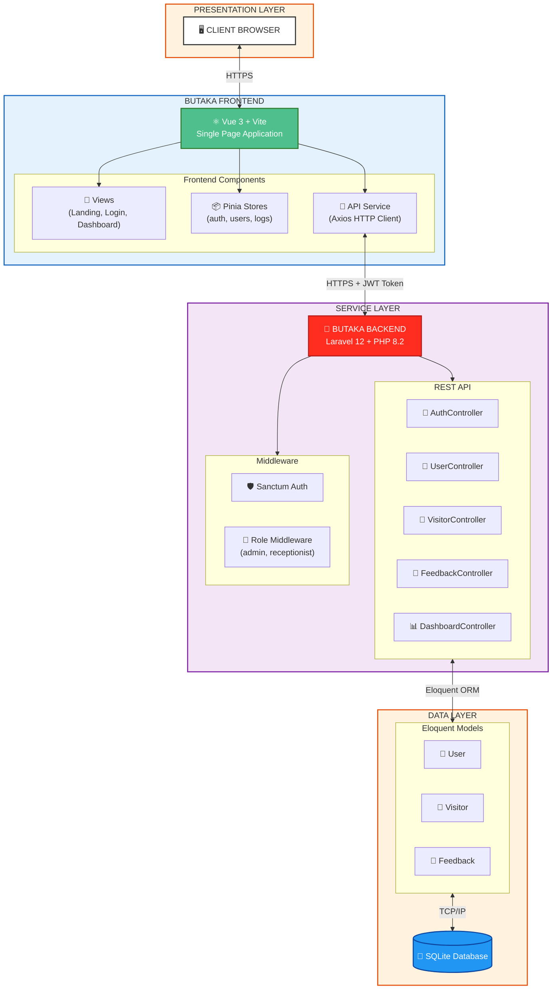
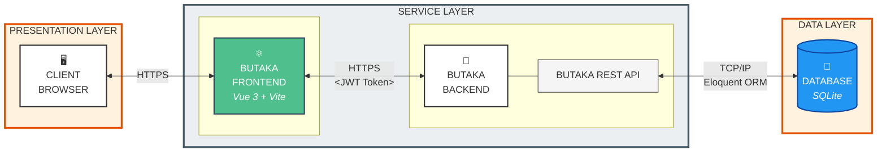

# BUTAKA Web Application Architecture

## 1. Penjelasan Arsitektur

### Overview
BUTAKA (Buku Tamu Kantor) adalah aplikasi web manajemen pengunjung yang menggunakan arsitektur **Client-Server** dengan pemisahan yang jelas antara **Frontend** dan **Backend** melalui **REST API**.

---

### Arsitektur Layer

#### 🖥️ PRESENTATION LAYER
**Komponen:** Client Browser

Ini adalah layer yang berinteraksi langsung dengan pengguna. Pengguna mengakses aplikasi melalui web browser yang menampilkan antarmuka pengguna (UI).

**Karakteristik:**
- Menampilkan UI responsif berbasis Vue 3
- Menangani interaksi pengguna (klik, input, navigasi)
- Mengirim request ke Service Layer melalui HTTPS

---

#### ⚛️ BUTAKA FRONTEND (Vue.js Application)
**Teknologi:** Vue 3 + Vite + TypeScript + Pinia + Axios

Frontend aplikasi yang berjalan di browser pengguna. Menggunakan arsitektur SPA (Single Page Application).

**Komponen Utama:**
| Komponen | Fungsi |
|----------|--------|
| `views/` | Halaman utama (Landing, Login, Admin Dashboard, Receptionist) |
| `stores/` | State management (auth, feedback, guestLogs, users) |
| `services/api.ts` | HTTP client untuk komunikasi dengan backend |
| `router/` | Navigasi dan routing aplikasi |

**Alur Komunikasi:**
- Mengirim HTTP request ke Backend REST API
- Menyertakan JWT Token (dari Sanctum) untuk autentikasi
- Menerima response dalam format JSON

---

#### 🔧 SERVICE LAYER
**Komponen:** BUTAKA Backend (Laravel REST API)

Backend aplikasi yang menangani logika bisnis dan menyediakan API endpoints.

**Teknologi:** Laravel 12 + PHP 8.2 + Sanctum

**Controllers (API Endpoints):**
| Controller | Fungsi |
|------------|--------|
| `AuthController` | Login, logout, register, profile management |
| `UserController` | CRUD manajemen user (Admin only) |
| `VisitorController` | Check-in, check-out, manajemen pengunjung |
| `FeedbackController` | Feedback dari pengunjung |
| `DashboardController` | Statistik dan laporan dashboard |

**Middleware:**
- `auth:sanctum` - Autentikasi API token
- `admin` - Akses khusus admin
- `admin_or_receptionist` - Akses admin dan resepsionis

**Alur Komunikasi:**
- Menerima HTTPS request dengan Token dari Frontend
- Memproses logika bisnis
- Query/manipulasi data ke Database via Eloquent ORM
- Mengembalikan response JSON ke Frontend

---

#### 💾 DATA LAYER
**Komponen:** SQLite Database

Layer penyimpanan data persisten aplikasi.

**Models (Tabel):**
| Model | Deskripsi |
|-------|-----------|
| `User` | Data pengguna (admin, receptionist) |
| `Visitor` | Data pengunjung yang melakukan check-in |
| `Feedback` | Feedback/rating dari pengunjung |

**Koneksi:** TCP/IP ke SQLite file database

---

### Alur Data (Data Flow)

```
┌─────────────────────────────────────────────────────────────────┐
│ 1. User membuka browser dan mengakses aplikasi                  │
│ 2. Browser menampilkan UI dari Vue Frontend                     │
│ 3. User melakukan aksi (login, check-in visitor, dll)           │
│ 4. Frontend mengirim HTTPS request + JWT Token ke Backend       │
│ 5. Backend memvalidasi token via Sanctum middleware             │
│ 6. Controller memproses request dan query database              │
│ 7. Database mengembalikan data                                  │
│ 8. Backend mengembalikan JSON response ke Frontend              │
│ 9. Frontend memperbarui UI dengan data terbaru                  │
└─────────────────────────────────────────────────────────────────┘
```

---

### Authentication Flow

```
┌──────────────┐     HTTPS (credentials)     ┌─────────────────┐
│   Browser    │ ──────────────────────────► │  Auth Controller │
│  (Frontend)  │                             │    (Backend)     │
│              │ ◄────────────────────────── │                  │
└──────────────┘     HTTPS (JWT Token)       └─────────────────┘
                                                      │
                                                      ▼
                                             ┌─────────────────┐
                                             │  Sanctum Token  │
                                             │    Database     │
                                             └─────────────────┘
```

---

## 2. Mermaid Diagram Code

### Diagram Utama (Main Architecture)



---

### Diagram Horizontal (Mirip Referensi)



---

### Component Diagram (Detail)

```mermaid
graph TB
    subgraph BROWSER["🌐 Client Browser"]
        UI["User Interface"]
    end

    subgraph VUEJS["⚛️ BUTAKA FRONTEND - Vue 3"]
        direction LR
        Router["Vue Router<br/>(Routing)"]
        Pinia["Pinia Store<br/>(State Management)"]
        Axios["Axios<br/>(HTTP Client)"]
        
        subgraph VIEWS["Views"]
            Landing["LandingPageView"]
            Login["LoginView"]
            AdminDash["Admin Dashboard"]
            Reception["Receptionist Views"]
        end
        
        subgraph STORES["Stores"]
            AuthStore["auth.ts"]
            UserStore["users.ts"]
            LogStore["guestLogs.ts"]
            FeedStore["feedback.ts"]
        end
    end

    subgraph LARAVEL["🔧 BUTAKA BACKEND - Laravel 12"]
        direction LR
        
        subgraph ROUTES["Routes"]
            ApiRoutes["api.php"]
        end
        
        subgraph CONTROLLERS["Controllers"]
            Auth["AuthController"]
            Users["UserController"]
            Visitors["VisitorController"]
            Feedbacks["FeedbackController"]
            Dashboard["DashboardController"]
        end
        
        subgraph MW["Middleware"]
            SanctumMW["Sanctum"]
            AdminMW["Admin"]
            ReceptionMW["AdminOrReceptionist"]
        end
        
        subgraph MODELS["Models (Eloquent)"]
            UserModel["User"]
            VisitorModel["Visitor"]
            FeedbackModel["Feedback"]
        end
    end

    subgraph DATABASE["💾 SQLite Database"]
        UsersTable["users"]
        VisitorsTable["visitors"]
        FeedbackTable["feedback"]
        TokensTable["personal_access_tokens"]
    end

    UI --> Router
    Router --> VIEWS
    VIEWS --> Pinia
    Pinia --> STORES
    STORES --> Axios
    Axios -->|"HTTPS + Token"| ApiRoutes
    ApiRoutes --> MW
    MW --> CONTROLLERS
    CONTROLLERS --> MODELS
    MODELS --> DATABASE

    style BROWSER fill:#FFF3E0,stroke:#E65100
    style VUEJS fill:#E8F5E9,stroke:#2E7D32
    style LARAVEL fill:#FFEBEE,stroke:#C62828
    style DATABASE fill:#E3F2FD,stroke:#1565C0
```



---

## Ringkasan Teknologi

| Layer | Teknologi | Deskripsi |
|-------|-----------|-----------|
| **Presentation** | Web Browser | Chrome, Firefox, Edge, dll |
| **Frontend** | Vue 3, Vite, TypeScript, Pinia, Axios | SPA dengan state management |
| **Backend** | Laravel 12, PHP 8.2, Sanctum | REST API dengan autentikasi token |
| **Database** | SQLite | Database file-based untuk development |
| **Authentication** | Laravel Sanctum | Token-based API authentication |

---

> **Catatan:** Diagram ini menggambarkan arsitektur aplikasi BUTAKA yang menggunakan pola pemisahan concerns antara Frontend dan Backend, berkomunikasi melalui REST API dengan autentikasi berbasis token (Sanctum).
