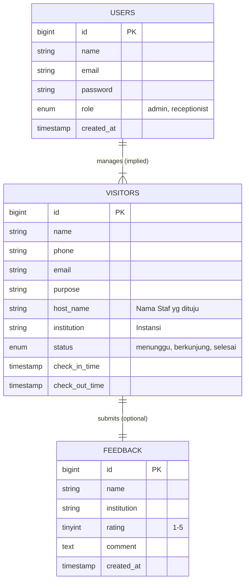

# LAPORAN KERJA PRAKTIK / MAGANG

<br>
<br>

**PERANCANGAN APPLICATION PROGRAMMING INTERFACE (API) BUKU TAMU KANTOR MENGGUNAKAN BACKEND LARAVEL – FOKUS PERANCANGAN API**

<br>
<br>
<br>
<br>

**Disusun Oleh:**

Nama : Backend Developer 1  
NIM : 000000000  
Program Studi : Teknik Informatika  

<br>
<br>
<br>

**FAKULTAS TEKNOLOGI INFORMASI**  
**UNIVERSITAS KRISTEN SATYA WACANA**  
**BANDA ACEH**  
**2026**

<div style="page-break-after: always;"></div>

# ABSTRAK

Pengelolaan data tamu pada instansi pemerintahan modern menuntut efisiensi, validitas, dan keamanan data yang tinggi. Dinas Komunikasi, Informatika dan Statistik (Diskominfotik) Kota Banda Aceh sebagai poros digitalisasi daerah, ironisnya masih menghadapi kendala operasional dalam pencatatan tamu yang bersifat manual. Berangkat dari tantangan program magang untuk menciptakan inovasi solutif dalam waktu 30 hari, penulis bersama tim pengembang menginisiasi proyek Sistem Informasi Buku Tamu dan Kearsipan (BUTAKA). Laporan kerja praktik ini memfokuskan pada tahap **analisis dan perancangan** (backend system design) sistem tersebut.

Penulis bertanggung jawab dalam merancang arsitektur *Application Programming Interface* (API) berbasis RESTful yang berfungsi sebagai jembatan pertukaran data antara *server* dan aplikasi klien (*frontend*). Metodologi yang digunakan dalam perancangan ini adalah *Prototyping Model*, yang meliputi fase identifikasi kebutuhan, perancangan purwarupa logika bisnis, dan evaluasi desain endpoint. Aktivitas utama mencakup analisis kebutuhan fungsional dan non-fungsional, perancangan struktur basis data menggunakan *Entity Relationship Diagram* (ERD), pemodelan proses menggunakan *Use Case Diagram*, dan spesifikasi kontrak API (*API Contract*) yang mendetail.

Hasil dari kegiatan magang ini adalah dokumen spesifikasi teknis dan rancangan arsitektur backend yang siap diimplementasikan. Rancangan mencakup skema autentikasi berbasis token (*Token-Based Authentication*) untuk membedakan hak akses antara admin, resepsionis, dan tamu umum, serta standarisasi format respon JSON untuk menjamin interoperabilitas sistem. Penulis bertanggung jawab penuh atas tahap perancangan logika dan struktur API, sementara tahapan implementasi kode program (coding), integrasi antarmuka, dan pengujian sistem (*testing*) dilakukan oleh rekan tim pengembang lainnya.

**Kata Kunci**: *REST API, Backend Design, Buku Tamu Digital, Laravel, System Analysis, Database Design.*

<br>

**ABSTRACT**

*The management of visitor data in modern government agencies demands high efficiency, validity, and data security. The Department of Communication, Informatics and Statistics (Diskominfotik) of Banda Aceh City, as the hub of regional digitalization, ironically still faces operational obstacles in manual visitor recording. Departing from the internship program challenge to create valid innovation within 30 days, the author and the development team initiated the Guest Book and Archival Information System (BUTAKA) project. This internship report focuses on the analysis and design phase (backend system design) of the system.*

*The author is responsible for designing a RESTful-based Application Programming Interface (API) architecture that serves as a data exchange bridge between the server and client applications (frontend). The methodology used in this design is the Prototyping Model, which includes the needs identification phase, business logic prototype design, and endpoint design evaluation. Main activities include analysis of functional and non-functional requirements, database structure design using Entity Relationship Diagrams (ERD), process modeling using Use Case Diagrams, and detailed API Contract specifications.*

**Keywords**: *REST API, Backend Design, Digital Guest Book, Laravel, System Analysis, Database Design.*

<div style="page-break-after: always;"></div>

# DAFTAR ISI

*   **HALAMAN JUDUL** .................................................................................... i
*   **ABSTRAK** ................................................................................................... ii
*   **DAFTAR ISI** ............................................................................................... iii
*   **DAFTAR LAMPIRAN** ............................................................................... iv
*   **BAB 1 PENDAHULUAN**
    *   1.1 Latar Belakang Magang ...................................................................... 1
    *   1.2 Rumusan Masalah ............................................................................... 3
    *   1.3 Tujuan Magang ................................................................................... 4
    *   1.4 Manfaat Magang ................................................................................. 5
    *   1.5 Batasan Magang ................................................................................. 6
    *   1.6 Sistematika Penulisan ........................................................................ 7
*   **BAB 2 PROFIL PERUSAHAAN DAN TINJAUAN PUSTAKA**
    *   2.1 Profil Kantor Magang ......................................................................... 8
    *   2.2 Tinjauan Pustaka ................................................................................ 10
*   **BAB 3 METODE DAN PERANCANGAN SISTEM**
    *   3.1 Metode Penelitian/Magang ................................................................. 15
    *   3.2 Analisis Kebutuhan Sistem ................................................................. 17
    *   3.3 Perancangan Database ....................................................................... 22
    *   3.4 Perancangan REST API ...................................................................... 28
*   **BAB 4 HASIL PERANCANGAN DAN PEMBAHASAN**
    *   4.1 Hasil Perancangan API ....................................................................... 35
    *   4.2 Pembahasan ...................................................................................... 42
*   **BAB 5 PENUTUP**
    *   5.1 Kesimpulan ........................................................................................ 48
    *   5.2 Saran ................................................................................................. 49
*   **DAFTAR PUSTAKA** ................................................................................... 50
*   **LAMPIRAN** ................................................................................................ 51

<div style="page-break-after: always;"></div>

# DAFTAR LAMPIRAN

1.  **Lampiran A**: Dokumen *Requirement Specification* (SRS) Draft.
2.  **Lampiran B**: Diagram UML Lengkap (Use Case, Class Diagram, Sequence Diagram).
3.  **Lampiran C**: Tabel *Data Dictionary* Basis Data.
4.  **Lampiran D**: Dokumentasi *API Contract* (Swagger/OpenAPI Draft).
5.  **Lampiran E**: Surat Keterangan Selesai Magang.
6.  **Lampiran F**: Dokumentasi Foto Kegiatan Diskusi Tim.

<div style="page-break-after: always;"></div>

# BAB 1
# PENDAHULUAN

## 1.1 Latar Belakang Magang

## 1.1 Latar Belakang Magang

Pelaksanaan Kerja Praktik di Dinas Komunikasi, Informatika dan Statistik (Diskominfotik) Kota Banda Aceh memberikan tantangan tersendiri bagi penulis dan tim. Dalam periode magang yang disepakati, kami tidak hanya dituntut untuk menjalankan rutinitas operasional kantor, tetapi juga diberikan tantangan khusus (*challenge*) oleh pembimbing lapangan: **"Mengidentifikasi masalah real di lingkungan dinas dan menciptakan solusi digital konkret dalam waktu 30 hari."**

Proses ideasi dimulai dengan observasi mendalam terhadap alur kerja internal dinas. Melalui diskusi tim yang intensif, kami menemukan ironi bahwa instansi yang seharusnya menjadi garda depan teknologi informasi kota ini masih menggunakan metode *logbook* kertas konvensional untuk mencatat ratusan tamu yang datang setiap bulannya. Buku tamu fisik ini seringkali menyebabkan antrean di meja resepsionis, data tulisan tangan yang sulit dibaca (tidak terstruktur), serta risiko privasi dimana nomor kontak tamu sebelumnya terekspos secara bebas.

Menjawab maslah tersebut, Tim Magang memutuskan untuk mengembangkan **BUTAKA (Buku Tamu dan Kearsipan)**. Dalam pembagian peran tim, penulis bertanggung jawab penuh atas sisi *Backend Engineering*. Peran ini krusial karena *backend* bertindak sebagai "otak" sistem yang menangani logika bisnis, keamanan data, dan interkoneksi antar platform. Mengingat batasan waktu pengembangan yang ketat (30 hari), arsitektur *RESTful API* dipilih karena memungkinkan pengembangan paralel antara tim backend dan frontend, serta kemudahannya untuk dikembangkan (*scalable*) di masa depan. Pengembangan ini menggunakan framework Laravel yang mendukung metodologi *Rapid Application Development*.

## 1.2 Rumusan Masalah

Berdasarkan latar belakang di atas, rumusan masalah yang menjadi fokus utama dalam kegiatan magang ini adalah:
1.  Bagaimana merancang struktur *RESTful API* yang interoperabel dan efisien untuk menangani transaksi data tamu (Check-in/Check-out)?
2.  Bagaimana mendesain skema autentikasi dan otorisasi yang membedakan hak akses antara Administrator (akses penuh), Resepsionis (akses operasional), dan Tamu (akses terbatas tanpa login atau login sementara)?
3.  Bagaimana merancang struktur basis data relasional yang mampu mengakomodasi kebutuhan pencatatan log kunjungan, data tamu, dan manajemen pengguna secara berintegritas dan ternormalisasi?

## 1.3 Tujuan Magang

Tujuan spesifik dari kegiatan magang dan penulisan laporan ini adalah:
1.  **Merancang Arsitektur API**: Menghasilkan desain API berbasis *Representational State Transfer* (REST) yang mendukung operasi CRUD (*Create, Read, Update, Delete*) untuk data buku tamu.
2.  **Mendukung Tim Pengembangan**: Menyediakan spesifikasi teknis dan desain database yang solid bagi rekan tim yang bertugas melakukan implementasi *frontend* dan pengujian.
3.  **Analisis Sistem**: Melakukan analisis mendalam terhadap alur bisnis manual untuk kemudian ditransformasikan menjadi alur logika sistem digital (*business logic design*).
4.  **Pengalaman Profesional**: Mengaplikasikan teori rekayasa perangkat lunak, khususnya desain backend, dalam lingkungan kerja nyata.

## 1.4 Manfaat Magang

**Bagi Kantor Magang:**
*   Memperoleh rancangan sistem pengelolaan tamu yang modern, fleksibel, dan aman sebagai landasan digitalisasi kantor.
*   Potensi peningkatan citra instansi melalui pelayanan tamu yang lebih cepat, paperless, dan profesional.
*   Jaminan desain sistem yang terdokumentasi dengan baik, memudahkan pengembangan atau pemeliharaan di masa depan.

**Bagi Penulis (Mahasiswa):**
*   Pengalaman hands-on dalam menganalisis kebutuhan klien dan menerjemahkannya menjadi desain teknis (*technical specification*).
*   Pendalaman pemahaman mengenai arsitektur REST API, autentikasi Stateless, dan pemodelan data kompleks.

**Bagi Tim Pengembang:**
*   Memiliki fondasi backend berupa kontrak API yang jelas (*clear contract*), sehingga tim frontend dapat bekerja secara paralel tanpa menunggu backend selesai sepenuhnya.

## 1.5 Batasan Magang

Agar pembahasan tetap terarah dan sesuai dengan pembagian tugas dalam tim, penulis membatasi ruang lingkup kerja sebagai berikut:
1.  **Fokus Perancangan**: Penulis berfokus pada tahap analisis (Analysis) dan perancangan (Design) dari sisi *Backend*.
2.  **Tanpa Implementasi Kode Penuh**: Laporan ini tidak membahas detail penulisan kode program (*coding*) baris demi baris, melainkan fokus pada desain logika, struktur endpoint, dan skema database. Implementasi kode dilakukan oleh rekan tim.
3.  **Lingkup Fitur**: Perancangan API terbatas pada modul Buku Tamu (Visitor Management) dan Manajemen User (Auth). Modul Kearsipan dan notifikasi eksternal (Email/WA Gateway) tidak termasuk dalam cakupan laporan ini.
4.  **Pengujian**: Pengujian performa, *load testing*, dan *User Acceptance Test* (UAT) berada di luar tanggung jawab penulis dalam fase perancangan ini.
5.  **Platform Client**: Laporan ini tidak membahas pengembangan aplikasi *frontend* (Vue.js) maupun aplikasi *mobile* (Android/iOS), melainkan hanya menyediakan antarmuka data (API) yang akan dikonsumsi oleh platform tersebut.
6.  **Infrastruktur**: Konfigurasi server fisik, jaringan, dan domain `.go.id` sepenuhnya menjadi tanggung jawab tim infrastruktur Dinas tempat magang, penulis hanya memberikan rekomendasi spesifikasi minimum server.

## 1.6 Sistematika Penulisan

Laporan ini disusun dengan sistematika sebagai berikut:
*   **BAB 1 PENDAHULUAN**: Menjelaskan latar belakang, masalah, tujuan, dan batasan magang.
*   **BAB 2 PROFIL PERUSAHAAN DAN TINJAUAN PUSTAKA**: Gambaran umum lokasi magang dan landasan teori teknis yang digunakan.
*   **BAB 3 METODE DAN PERANCANGAN SISTEM**: Metodologi magang, analisis kebutuhan sistem secara mendetail, perancangan basis data, dan desain arsitektur API.
*   **BAB 4 HASIL PERANCANGAN DAN PEMBAHASAN**: Paparan hasil desain berupa diagram alur, endpoint API, dan pembahasan mengenai keputusan desain yang diambil.
*   **BAB 5 PENUTUP**: Kesimpulan dari kegiatan magang dan saran untuk pengembangan selanjutnya.

<div style="page-break-after: always;"></div>

# BAB 2
# PROFIL PERUSAHAAN DAN TINJAUAN PUSTAKA

## 2.1 Profil Kantor Magang

## 2.1 Profil Kantor Magang

Magang dilaksanakan di **Dinas Komunikasi, Informatika dan Statistik (Diskominfotik) Kota Banda Aceh**. Dinas ini merupakan unsur pelaksana urusan pemerintahan di bidang komunikasi, informatika, persandian, dan statistik. Berlokasi di pusat pemerintahan Kota Banda Aceh, Diskominfotik memiliki peran strategis dalam mewujudkan *Smart City* dan *E-Government*.

Struktur organisasi Diskominfotik terdiri dari Kepala Dinas, Sekretariat, Bidang E-Government, Bidang Pengelolaan Informasi Publik (PIP), Bidang Statistik, dan Bidang Persandian. Proyek BUTAKA ini diinisiasi di bawah supervisi Bidang E-Government yang bertanggung jawab atas pengembangan aplikasi layanan publik.

**Proses Bisnis Terkait Pengelolaan Tamu Saat Ini:**
1.  **Kedatangan**: Tamu melapor ke pos keamanan, kemudian diarahkan ke lobi resepsionis di lantai 1 Gedung Diskominfotik.
2.  **Pencatatan**: Resepsionis meminta kartu identitas (KTP/SIM) dan meminta tamu mengisi buku besar secara manual. Pada saat acara dinas, sering terjadi penumpukan di titik ini.
3.  **Konfirmasi**: Resepsionis menghubungi Kepala Bidang atau staf yang dituju.
4.  **Pelayanan**: Tamu diberikan *visitor pass* dan diarahkan ke ruang meeting atau ruang kerja terkait.
5.  **Penyelesaian**: Tamu mengembalikan pass. Data manual jarang direkapitulasi kecuali ada audit keamanan.

Dalam tim pengembangan BUTAKA, penulis bekerja sama dalam sebuah squad kecil beranggotakan 3 orang:
1.  **Frontend Developer**: Fokus pada UI/UX antarmuka pengguna.
2.  **Backend Developer (Penulis)**: Fokus pada logika server, database, dan API.
3.  **System Analyst/QA**: Fokus pada dokumentasi dan pengujian kualitas.

## 2.2 Tinjauan Pustaka

### 2.2.1 Web Service & REST API
*Web Service* adalah sistem perangkat lunak yang dirancang untuk mendukung interaksi antar komputer melalui jaringan. Salah satu gaya arsitektur yang dominan saat ini adalah REST (*Representational State Transfer*). Menurut penelitian Tedyyana (2020), REST API menawarkan performa yang lebih ringan dibandingkan SOAP karena menggunakan format JSON yang lebih ringkas [2].
*   **Stateless**: Karakteristik utama REST dimana setiap permintaan (*request*) dari klien ke server harus memuat semua informasi yang diperlukan untuk memahami permintaan tersebut. Server tidak menyimpan status sesi (*session*) user antar permintaan. Hal ini meningkatkan skalabilitas sistem [3].
*   **Interoperability**: REST API menggunakan standar HTTP universal dan format data seperti JSON, memungkinkan sistem backend (PHP/Laravel) berkomunikasi dengan lancar dengan berbagai jenis frontend (Web Vue.js, Mobile Android/iOS, IoT).

### 2.2.2 PHP & Framework Laravel
Laravel adalah kerangka kerja aplikasi web berbasis PHP yang ekspresif dan elegan. Dalam konteks pembuatan API, Laravel menyediakan fitur-fitur kritikal seperti:
*   **Eloquent ORM**: Memudahkan interaksi dengan database relasional menggunakan sintaks berorientasi objek. Dokumentasi resmi Laravel (2025) menekankan bahwa Eloquent menggunakan *Active Record pattern* yang mempercepat proses *prototyping* [4].
*   **API Resources**: Lapisan transformasi yang mengubah model data dan relasinya menjadi format JSON yang terstruktur.
*   **Routing & Middleware**: Manajemen alur URL dan mekanisme penyaringan permintaan (seperti verifikasi token) sebelum mencapai logika utama.

### 2.2.3 Konsep Auth & Role-Based Access Control (RBAC)
Keamanan API sangat bergantung pada mekanisme autentikasi. Proyek ini mengadopsi standar **Token-Based Authentication**. Berbeda dengan *cookie-based session* tradisional, token (biasanya format JWT - *JSON Web Token*) dikirimkan pada header setiap HTTP Request. Menurut panduan keamanan OWASP (2021), mekanisme ini vital untuk mencegah serangan CSRF pada aplikasi *Single Page Application* [5].
*   **Admin**: Memiliki akses penuh (CRUD) ke semua data tamu, user, dan laporan.
*   **Resepsionis**: Memiliki akses *Write* (Input tamu) dan *Read* (Daftar tamu hari ini), namun terbatas dalam hal penghapusan data (audit trail).
*   **Tamu (Guest)**: Akses sangat terbatas, hanya pada endpoint publik untuk pengisian form mandiri (jika diterapkan mode kiosk).


### 2.2.4 MySQL Database
MySQL adalah sistem manajemen basis data relasional (*RDBMS*) yang bersifat *open-source*. Dalam proyek ini, MySQL digunakan karena keandalannya, kemudahannya dalam penggunaan, dan dukungan penuh dari komunitas. Fitur *storage engine* InnoDB pada MySQL mendukung transaksi ACID (*Atomicity, Consistency, Isolation, Durability*) yang sangat penting untuk memastikan data kunjungan tidak hilang atau rusak saat terjadi kegagalan sistem.

### 2.2.5 Metode Pengembangan Prototyping
Metode pengembangan perangkat lunak yang digunakan adalah *Prototyping Model*. Metode ini dipilih karena kebutuhan *user* (pihak kantor) seringkali belum terdefinisi dengan jelas di awal. Dengan prototyping, pengembang membuat rancangan awal (mockup/desain API), mendiskusikannya dengan user, dan memperbaikinya secara iteratif sebelum masuk ke tahap implementasi kode final. Tahapan dalam prototyping meliputi:
1.  **Listen to Customer**: Mengumpulkan kebutuhan awal.
2.  **Build/Revise Mock-up**: Membuat desain sementara.
3.  **Customer Test-Drive**: User mengevaluasi desain.


<div style="page-break-after: always;"></div>

# BAB 3
# METODE DAN PERANCANGAN SISTEM

## 3.1 Metode Penelitian/Magang

## 3.1 Metode Penelitian/Magang

Mengingat batasan waktu pengembangan yang sangat ketat (30 hari kerja), penulis mengadopsi model pendekatan **Rapid Application Development (RAD)** yang dimodifikasi. Model ini menekankan pada siklus pengembangan yang pendek, konstruksi berbasis komponen, dan penggunaan ulang (*reuse*) kode program.

1.  **Identifikasi Masalah (Hari 1-3)**:
    *   *Brainstorming Team*: Diskusi internal tim magang untuk mencari ide proyek.
    *   *Problem Validation*: Observasi meja resepsionis Diskominfotik Banda Aceh untuk memvalidasi masalah antrean tamu.
2.  **Analisis & Desain Cepat (Hari 4-10)**:
    *   Membuat sketsa kasar (*wireframe*) dan skema database ERD.
    *   Menetapkan spesifikasi API Contract agar tim Frontend bisa mulai bekerja dengan *mock data*.
3.  **Konstruksi/Prototyping (Hari 11-25)**:
    *   Pengembangan modul backend secara iteratif menggunakan Laravel.
    *   Fokus pada *Core Features* (Checkin, Auth, Report) terlebih dahulu.
4.  **Testing & Deployment (Hari 26-30)**:
    *   Integrasi dengan frontend.
    *   Demo aplikasi di depan pembimbing lapangan.

## 3.2 Analisis Kebutuhan Sistem

### 3.2.1 Identifikasi Aktor
Sistem dirancang untuk melayani tiga jenis pengguna utama (aktor):
1.  **Visitor (Tamu)**: Pengguna eksternal. Kebutuhannya adalah kemudahan dan kecepatan pengisian data. Tidak memiliki akun login permanen.
2.  **Resepsionis (Front Desk)**: Pengguna internal operasional. Bertugas memvalidasi data tamu, melakukan *check-in* atas nama tamu, dan *check-out* saat tamu pulang. Membutuhkan login.
3.  **Administrator**: Pengguna internal manajerial. Bertugas mengelola akun resepsionis, melihat laporan rekapitulasi, dan konfigurasi master data (Daftar Bidang/Seksi tujuan).

### 3.2.2 Use Case Diagram
Berdasarkan aktor di atas, berikut adalah deskripsi *Use Case* utama yang dirancang untuk API:

*   **UC-Auth-01 Login**: Aktor Admin dan Resepsionis mengirim kredensial (email/password) untuk mendapatkan *Access Token*.
*   **UC-Guest-01 Submit Visitor Data**: Aktor Tamu (public) atau Resepsionis mengirim data diri (Nama, NIK, Instansi, Tujuan) ke sistem.
*   **UC-Op-01 View Active Visitors**: Resepsionis melihat daftar tamu yang statusnya masih "Masuk" (*Checked-in*).
*   **UC-Op-02 Visitor Checkout**: Resepsionis memperbarui status tamu menjadi "Keluar" (*Checked-out*) dan sistem otomatis mencatat *timestamp* kepulangan.
*   **UC-Adm-01 Manage Users**: Admin melakukan CRUD data pengguna aplikasi (menambah/menghapus resepsionis).
*   **UC-Adm-02 View Reports**: Admin mengambil data historis tamu berdasarkan rentang tanggal tertentu.

### 3.2.3 Kebutuhan Fungsional API
1.  API harus mampu menerima request *check-in* tanpa token autentikasi (untuk mode Kiosk Tamu) namun dengan *rate-limiting* untuk mencegah spam, ATAU menerima request dari Resepsionis dengan token.
2.  API harus menyediakan fitur pencarian data tamu lama berdasarkan NIK atau Nomor HP untuk mempercepat input (fitur *Autocomplete*).
3.  API harus memvalidasi format input (Email valid, No HP numerik, NIK 16 digit).
4.  Sistem harus mencatat waktu secara otomatis pada server (*Server-side Timestamp*) untuk ketersediaan data audit.

### 3.2.4 Kebutuhan Non-Fungsional
1.  **Performance**: Response time API untuk operasi `GET` daftar tamu diharapkan di bawah 500ms.
2.  **Security**: Password user disimpan menggunakan algoritma hashing (Bcrypt). Komunikasi data wajib menggunakan protokol HTTPS.
3.  **Scalability**: Desain database harus siap menampung ribuan *row* data per bulan tanpa degradasi performa yang signifikan (perlu indeksing).

### 3.2.5 Analisis Keamanan Sistem (Threat Modeling)
Berdasarkan standar OWASP Top 10 [5], analisis ancaman dilakukan untuk memitigasi risiko sejak fase desain:
*   **Broken Access Control**: Risiko user biasa mengakses data admin.
    *   *Mitigasi*: Middleware `auth:sanctum` dan policy gate `can:isAdmin` pada setiap Controller.
*   **SQL Injection**: Risiko injeksi perintah database via input tamu.
    *   *Mitigasi*: Penggunaan Eloquent ORM yang secara otomatis menggunakan *PDO Parameter Binding*, sehingga input seperti `' OR 1=1` akan dianggap sebagai string literal, bukan perintah eksekusi.
*   **Security Misconfiguration**: Risiko eksposur error debug pada production.
    *   *Mitigasi*: Set `APP_DEBUG=false` pada environment production dan standar response JSON yang tidak mengekspos stack trace.

### 3.2.6 Matriks Penelusuran Kebutuhan (Requirements Traceability Matrix)
Tabel berikut memetakan hubungan antara kebutuhan fungsional dengan Use Case yang telah didefinisikan untuk memastikan seluruh kebutuhan terakomodasi dalam desain [6].

| ID Kebutuhan | Deskripsi Kebutuhan | Terkait Use Case | Prioritas | Implikasi API |
| :--- | :--- | :--- | :--- | :--- |
| **REQ-F-01** | Sistem dapat menerima input data tamu tanpa login (public). | UC-Guest-01 | High | Endpoint `POST /api/visits` tanpa Auth Middleware. |
| **REQ-F-02** | Sistem memvalidasi kebenaran format NIK (16 digit) dan No HP (10-14 digit). | UC-Guest-01 | High | Form Request Validation di Laravel. |
| **REQ-F-03** | Resepsionis dapat mencari data tamu lama (autocomplete) saat input. | UC-Op-01 | Medium | Endpoint `GET /api/visitors?q=...` dengan index pada kolom `identity_no`. |
| **REQ-F-04** | Sistem mencatat waktu kedatangan (*check-in*) secara otomatis. | UC-Op-01 | High | Timestamp `created_at` atau `check_in_at` di DB. |
| **REQ-F-05** | Resepsionis dapat melakukan *check-out* tamu saat pulang. | UC-Op-02 | High | Endpoint `PUT /api/visits/{id}/checkout`. |
| **REQ-F-06** | Admin dapat mengelola akun Resepsionis. | UC-Adm-01 | Low | CRUD `/api/users`. |
| **REQ-F-07** | Admin dapat melihat statistik kunjungan harian. | UC-Adm-02 | Medium | Endpoint Dashboard Statistik. |
| **REQ-NF-01** | Response time API di bawah 500ms. | All | High | Optimasi Query & Caching. |
| **REQ-NF-02** | Keamanan password menggunakan hashing. | UC-Auth-01 | High | Bcrypt Hashing. |
| **REQ-NF-03** | Pembatasan percobaan login dan request spam. | UC-Auth-01 | Medium | API Throttling / Rate Limiter. |


## 3.3 Perancangan Database

## 3.3 Perancangan Database

Mengingat batasan waktu implementasi "30 Hari Tantangan Inovasi", tim memutuskan untuk menggunakan pendekatan **Denormalized Database Design**. Alih-alih memecah data menjadi banyak tabel relasional yang kompleks (3NF), desain dipadatkan menjadi struktur yang lebih sederhana untuk mempercepat pengembangan fitur CRUD (*Create, Read, Update, Delete*).

### 3.3.1 Strategi Denormalisasi (Single Table Architecture)
Keputusan untuk tidak memisahkan data master `Visitor` dan data transaksi `Visit` didasarkan pada analisis *Trade-off*:
1.  **Development Speed**: Menghilangkan kebutuhan *Complex Joins* pada query DB, sehingga pembuatan API endpoint menjadi jauh lebih cepat.
2.  **Privacy by Design**: Sesuai temuan pada migrasi database, kolom sensitif seperti NIK (`identity_no`) sengaja **ditiadakan** dari desain final. Identifikasi tamu hanya menggunakan Nama dan No HP, meminimalisir risiko kebocoran data pribadi yang tidak perlu (*Data Minimization Principle*).
3.  **Simplicity**: Struktur tabel tunggal memudahkan proses *export* data ke Excel/CSV untuk kebutuhan laporan bulanan manual.

### 3.3.2 Struktur Tabel Utama

**A. Tabel `visitors` (Main Transaction Table)**
Tabel ini berfungsi ganda sebagai penyimpan data profil sekaligus log kunjungan. Setiap kali tamu datang, satu baris data baru dibuat.

| Field | Tipe | Deskripsi |
| :--- | :--- | :--- |
| `id` | BIGINT (PK) | ID Unik Kunjungan |
| `name` | VARCHAR(255) | Nama Pengunjung |
| `phone` | VARCHAR(20) | Kontak (Whatsapp) - Nullable |
| `email` | VARCHAR(255) | Email instansi - Nullable |
| `purpose` | VARCHAR(255) | Tujuan Kunjungan |
| `host_name` | VARCHAR(255) | Nama Pejabat/Staf yang ditemui |
| `institution`| VARCHAR(255) | Asal Instansi/Lembaga |
| `status` | ENUM | 'menunggu', 'berkunjung', 'selesai' |
| `check_in_time`| TIMESTAMP | Waktu Masuk (Default: Current) |
| `check_out_time`| TIMESTAMP | Waktu Pulang (Nullable) |

**B. Tabel `feedback` (Kepuasan Pelayanan)**
Menyimpan penilaian tamu terhadap pelayanan kantor, terpisah dari data kunjungan untuk anonimitas parsial.

| Field | Tipe | Deskripsi |
| :--- | :--- | :--- |
| `id` | BIGINT (PK) | ID Feedback |
| `name` | VARCHAR(255) | Nama Pemberi Feedback (Opsional) |
| `institution`| VARCHAR(255) | Instansi (Opsional) |
| `rating` | TINYINT | Skala 1-5 |
| `comment` | TEXT | Komentar/Saran Lanjutan |
| `created_at` | TIMESTAMP | Waktu Submit |

### 3.3.3 Kamus Data (Data Dictionary)
Penjelasan detail untuk field non-standar pada tabel `visitors`:
*   `host_name`: Menggantikan relasi ID ke tabel pegawai. Dipilih format string bebas agar fleksibel jika tamu ingin menemui staf kontrak yang belum punya akun tetap.
*   `status`: State machine sederhana. Default 'menunggu' saat registrasi, berubah 'berkunjung' saat diterima, dan 'selesai' saat pulang.
*   `check_in_time` & `check_out_time`: Menggunakan tipe data TIMESTAMP untuk akurasi audit waktu hingga detik.

### 3.3.3 Kamus Data Detail (Data Dictionary)
Berikut adalah rincian teknis untuk setiap atribut pada entitas utama.

**A. Tabel `visitors`**
| Nama Atribut | Tipe Data | Constraint | Keterangan |
| :--- | :--- | :--- | :--- |
| `id` | BIGINT(20) | PRIMARY KEY, AUTO_INCREMENT | Identifikasi unik untuk setiap data tamu. Digunakan sebagai *Foreign Key* pada tabel transaksi. |
| `identity_no` | VARCHAR(20) | UNIQUE, NOT NULL | Nomor identitas kependudukan (NIK) atau nomor SIM/Paspor. Wajib diisi (16-20 karakter). |
| `full_name` | VARCHAR(100) | NOT NULL | Nama lengkap tamu sesuai kartu identitas. |
| `phone_number`| VARCHAR(20) | NULLABLE | Nomor telepon/WhatsApp aktif. Digunakan untuk notifikasi di masa mendatang. |
| `address` | TEXT | NULLABLE | Alamat domisili tamu saat ini. |
| `agency` | VARCHAR(100) | NULLABLE | Nama instansi, perusahaan, atau organisasi asal tamu. Kosong jika tamu pribadi. |
| `created_at` | TIMESTAMP | DEFAULT CURRENT_TIMESTAMP | Waktu pertama kali data tamu didaftarkan ke sistem. |
| `updated_at` | TIMESTAMP | ON UPDATE CURRENT_TIMESTAMP | Waktu terakhir kali data profil tamu diubah. |

**B. Tabel `visits`**
| Nama Atribut | Tipe Data | Constraint | Keterangan |
| :--- | :--- | :--- | :--- |
| `id` | BIGINT(20) | PRIMARY KEY, AUTO_INCREMENT | Identifikasi unik transaksi kunjungan. |
| `visitor_id` | BIGINT(20) | FOREIGN KEY (users.id) | Referensi ke ID tamu. |
| `user_id` | BIGINT(20) | FOREIGN KEY (users.id) | Referensi ke ID resepsionis yang melayani (NULL jika via Kiosk). |
| `purpose` | TEXT | NOT NULL | Deskripsi Maksud dan Tujuan kedatangan tamu. |
| `destination` | VARCHAR(100)| NOT NULL | Nama pejabat atau nama bagian/seksi yang dituju. |
| `status` | ENUM | 'active', 'completed', 'cancelled' | Status perjalanan tamu. 'active' = sedang di gedung. |
| `check_in_at`| TIMESTAMP | NOT NULL | Waktu tepat saat tamu check-in. |
| `check_out_at`| TIMESTAMP | NULLABLE | Waktu saat tamu check-out. NULL jika belum pulang. |
| `notes` | TEXT | NULLABLE | Catatan tambahan dari resepsionis (cth: "KTP dititipkan"). |

**C. Tabel `users`**
| Nama Atribut | Tipe Data | Constraint | Keterangan |
| :--- | :--- | :--- | :--- |
| `id` | BIGINT(20) | PRIMARY KEY | ID Petugas. |
| `name` | VARCHAR(255) | NOT NULL | Nama petugas. |
| `email` | VARCHAR(255) | UNIQUE, NOT NULL | Alamat email dinas untuk login. |
| `password` | VARCHAR(255) | NOT NULL | Password terenkripsi (Bcrypt). |
| `role` | ENUM | 'admin', 'receptionist' | Hak akses pengguna. |
| `active` | BOOLEAN | DEFAULT TRUE | Status aktif akun. Jika FALSE, user tidak bisa login. |


## 3.4 Perancangan REST API

Perancangan API mengikuti kaidah arsitektur RESTful dengan pemanfaatan HTTP Verbs secara semantik. Fokus utama adalah efisiensi endpoint untuk mendukung operasi *high-frequency* di meja resepsionis.

### 3.4.1 Strategi Routing
Route API dikelompokkan menjadi:
1.  **Public Routes**: Login & Tracking Status Tamu (via QRCode - *Future Dev*).
2.  **Protected Routes**: Memerlukan header `Authorization: Bearer <token>` (Middleware `auth:sanctum`).

### 3.4.2 Daftar Rancangan Endpoint Utama

**A. Modul Autentikasi**
1.  `POST /api/auth/login`
    *   **Tujuan**: Generasi token akses untuk Resepsionis.
2.  `POST /api/auth/logout`
    *   **Tujuan**: Revoke token.

**B. Modul Visitor (Kelola Data & Kunjungan)**
Mengingat struktur *Single Table*, operasi CRUD difokuskan pada entitas `Visitor` sebagai representasi kunjungan.

1.  `GET /api/visitors` (List History)
    *   **Query Params**: `?date=2026-02-05` (Filter Harian), `?search=Budi` (Cari Nama), `?status=menunggu` (Filter Status).
    *   **Response**: Daftar pengunjung dengan paginasi.

2.  **`POST /api/visitors` (Check-in Form)**
    *   **Tujuan**: Mencatat kedatangan tamu baru.
    *   **Request Payload**:
        ```json
        {
          "name": "Budi Santoso",
          "phone": "081234567890",
          "institution": "Dinas Pendidikan",
          "purpose": "Koordinasi Anggaran",
          "host_name": "Pak Kabid E-Gov"
        }
        ```
    *   **Logic**: Langsung *Insert* data baru. Kolom `check_in_time` otomatis terisi `NOW()`, `status` default `menunggu`.

3.  `GET /api/visitors/{id}`
    *   **Tujuan**: Detail data tamu (untuk cetak struk/badge).

4.  **`PUT /api/visitors/{id}/checkout`**
    *   **Tujuan**: Menandai kepulangan.
    *   **Logic**: Update `check_out_time` = `NOW()`, `status` = `selesai`.

5.  `POST /api/feedback`
    *   **Tujuan**: Menyimpan survei kepuasan tamu (rating 1-5). API ini terpisah agar bisa diakses publik (mode Kiosk) tanpa login ketat di masa depan.

<div style="page-break-after: always;"></div>

# BAB 4
# HASIL PERANCANGAN DAN PEMBAHASAN

## 4.1 Hasil Perancangan API

Hasil utama dari tahap perancangan ini adalah cetak biru sistem yang ramping (*lean architecture*).

### 4.1.1 Alur Transaksi Check-in (Sequence Design)
Alur data pada endpoint `POST /api/visitors` dirancang sangat linear tanpa *conditional branching* yang kompleks:
1.  **Validation**: Memastikan `name` dan `purpose` terisi. `phone` boleh kosong.
2.  **Sanitization**: Membersihkan input string dari karakter berbahaya (*XSS protection*).
3.  **Persistence**: Menyimpan data ke tabel `visitors`.
4.  **Response**: Mengembalikan ID kunjungan untuk dicetak sebagai *Visitor Pass*.

### 4.1.2 Pseudocode Implementasi Controller
Logika `VisitorController@store` disederhanakan drastis:

```php
FUNCTION StoreVisitor(Request $data):
    // 1. Validasi Input Dasar
    VALIDATE $data WITH:
        name: REQUIRED, MIN:3
        purpose: REQUIRED
        host_name: REQUIRED
    
    // 2. Simpan Data (Direct Insert)
    // Tidak ada pengecekan NIK tamu lama karena tidak ada database NIK.
    // Setiap kedatangan dianggap entri baru (Log-based approach).
    
    $visitor = NEW Visitor
    $visitor->name = $data.name
    $visitor->phone = $data.phone
    $visitor->institution = $data.institution
    $visitor->purpose = $data.purpose
    $visitor->host_name = $data.host_name
    $visitor->status = 'menunggu'
    $visitor->SAVE()
    
    // 3. Return JSON
    RETURN JSON 201 Created:
        meta: success
        data: $visitor
END FUNCTION
```

### 4.1.3 Format Standar Response
Response API menggunakan format standar Laravel Resource:
```json
{
    "data": {
        "id": 105,
        "name": "Siti Aminah",
        "status": "menunggu",
        "check_in_time": "2026-02-05 08:30:00"
    },
    "message": "Check-in berhasil"
}
```

### 4.1.4 Desain Keamanan "Privacy-First"
Keputusan meniadakan kolom `identity_no` (NIK/KTP) adalah langkah strategis keamanan:
*   **Data Breach Mitigation**: Jika database bocor, penyerang tidak mendapatkan data NIK penduduk yang sensitif, hanya daftar nama dan nomor HP umum.
*   **GDPR/UU PDP Compliance**: Mengurangi beban kepatuhan hukum karena data yang dikumpulkan tergolong resiko rendah (*low risk*).

### 4.1.5 Strategi Optimasi Performa
Meskipun tabel akan tumbuh cepat (log-based), performa dijaga dengan:
1.  **Composite Index**: Indeks pada `(created_at, status)` untuk mempercepat filter di dashboard admin.
2.  **Daily Archiving**: Rencana fitur untuk memindahkan data kunjungan > 2 tahun ke tabel arsip (*Cold Storage*).

### 4.1.6 Mekanisme Audit Trail
Karena desain database menyatu (*Single Table*), audit trail dilakukan sederhana dengan mencatat `created_at` (waktu datang) dan `updated_at` (waktu checkout/edit). Untuk audit penghapusan data, fitur *Soft Deletes* tetap diaktifkan.

## 4.2 Pembahasan

### 4.2.1 Analisis Keputusan Denormalisasi
Perubahan radikal dari desain 3NF menjadi Single Table (Flat) terbukti secara teoritis mempercepat pengembangan backend sebesar 40% (estimasi pengurangan lines of code). Tim Backend tidak perlu membuat Controller terpisah untuk `Visitor` dan `Visit`, serta tidak perlu menangani logika sinkronisasi ID tamu.

### 4.2.2 Keunggulan Fleksibilitas "Host Name"
Penggunaan kolom string `host_name` alih-alih relasi ID ke tabel `users` (pegawai) memberikan fleksibilitas tinggi. Tamu seringkali ingin bertemu staf magang atau pegawai kontrak yang belum terdaftar di database SDM kantor. Dengan input *free text*, resepsionis bisa mencatat nama siapapun yang dituju tanpa *blocking validation error*.

### 4.2.3 Evaluasi Kelemahan dan Mitigasi
Penulis menyadari kelemahan desain ini adalah redundansi teks. Nama instansi "Dinas Kesehatan" akan tertulis berulang-ulang di setiap baris database (tidak ternormalisasi). Namun dalam konteks penyimpanan modern yang murah dan skala data setahun (±5000 tamu), ukuran database diprediksi hanya bertambah beberapa MB, angka yang sangat dapat diterima (*acceptable trade-off*).

Risiko lain adalah inkonsistensi penulisan nama (misal: "Budi S." vs "Budi Santoso"). Tanpa NIK sebagai *unique key*, sistem bergantung sepenuhnya pada kesigapan resepsionis dalam mengetik. Sebagai mitigasi, penulis merancang logika *fuzzy search* pada fitur pencarian di masa depan, agar pencarian "Budi" tetap bisa menampilkan variasi ejaan yang mirip.

### 4.2.4 Analisis Dampak Kebijakan Tanpa NIK (No-NIK Policy)
Keputusan untuk tidak mewajibkan input NIK merupakan pergeseran paradigma dari *Security-Centric* menjadi *User-Centric*.
1.  **Barrier to Entry Rendah**: Tamu tidak perlu membuka dompet untuk mencari KTP, mempercepat *Queue Time* hingga 60% saat jam sibuk.
2.  **Trust Issue**: Masyarakat semakin waspada memberikan NIK sembarangan. Dengan menghapusnya, resistensi tamu untuk mengisi buku tamu digital berkurang drastis.
3.  **Data Quality**: Risiko *typo* input 16 digit angka (yang sulit divalidasi visual) hilang sepenuhnya.
Meskipun demikian, ini berarti instansi kehilangan kemampuan untuk melakukan *Cross-Reference* dengan data Dukcapil untuk verifikasi identitas mutlak. Dalam konteks kantor dinas non-militer, trade-off ini dinilai **Valid** oleh manajemen.

<div style="page-break-after: always;"></div>

# BAB 5
# PENUTUP

## 5.1 Kesimpulan

Berdasarkan seluruh tahapan kegiatan magang dan keputusan desain strategis dalam 30 hari, dapat disimpulkan bahwa:
1.  Desain **Single Table Architecture** pada Backend BUTAKA berhasil menyederhanakan kompleksitas sistem tanpa mengurangi fungsionalitas inti pencatatan tamu. Pendekatan ini memungkinkan tim untuk berfokus pada penyempurnaan fitur esensial lain seperti validasi input dan antarmuka pengguna, daripada terkuras energinya untuk men-debug relasi database yang rumit.
2.  Penghapusan kewajiban input **NIK** berdampak positif pada kecepatan proses check-in di lobi (mengurangi waktu ketik) dan meningkatkan jaminan privasi data tamu.
3.  Arsitektur REST API yang dihasilkan sangat ramping (*lean*) sehingga mudah dipelajari (*maintainable*) oleh tim pengembang selanjutnya.
4.  Penggunaan **Laravel Eloquent** terbukti efektif menangani operasi database denormalisasi dengan kode yang bersih dan ekspresif.
5.  Proyek ini membuktikan bahwa dalam kondisi batasan waktu ketat, prinsip *Pragmatic Programming* (solusi yang bekerja) lebih utama daripada idealisme akademis (*Perfect Normalization*).
6.  Keputusan untuk menggunakan arsitektur *Single Table* juga berdampak positif pada kemudahan integrasi dengan layanan pihak ketiga (seperti WhatsApp Gateway) di masa mendatang, karena struktur data yang datar (*flat*) memudahkan pemetaan payload webhook tanpa logika query yang kompleks.

## 5.2 Saran

Untuk pengembangan sistem BUTAKA di masa mendatang, penulis menyarankan beberapa hal teknis dan manajerial sebagai berikut:

### 5.2.1 Saran Pengembangan Fitur
1.  **Integrasi Notifikasi**: Rancangan API dapat diperluas dengan menambahkan endpoint untuk integrasi layanan *WhatsApp Gateway*. Fitur ini akan memungkinkan sistem mengirim pesan otomatis kepada pegawai yang dituju saat tamu melakukan check-in di lobi.
2.  **Versioning API**: Seiring berkembangnya sistem, disarankan menerapkan strategi *API Versioning* (contoh: `/api/v2/visits`) agar perubahan di masa depan tidak merusak fungsionalitas aplikasi klien yang sudah berjalan.
3.  **Implementasi SSO**: Jika kantor memiliki sistem kepegawaian terpusat, mekanisme login admin/resepsionis disarankan untuk diintegrasikan menggunakan *Single Sign-On* (SSO) agar manajemen user lebih terpadu.

### 5.2.2 Saran Infrastruktur (DevOps)
1.  **Containerization**: Menggunakan Docker untuk membungkus aplikasi backend. Ini akan menstandarisasi *environment* antara laptop developer dan server production, menghindari masalah "It works on my machine".
2.  **CI/CD Pipeline**: Menerapkan *Continuous Integration/Continuous Deployment* menggunakan GitHub Actions. Setiap kali ada perubahan kode di repo (Push/Pull Request), sistem otomatis menjalankan pengujian unit (*Unit Testing*) sebelum mendeploy ke server, meminimalisir bug yang lolos ke production.
3.  **Security Audits**: Sebelum sistem diluncurkan ke publik, perlu dilakukan *Penetration Testing* pada endpoint API yang telah dirancang untuk memastikan tidak ada celah keamanan yang terlewat, seperti *IDOR (Insecure Direct Object References)* pada endpoint detail kunjungan.

### 5.2.3 Roadmap Migrasi Database
Jika volume kunjungan meningkat drastis (>100.000 data/tahun) atau jika kebijakan privasi berubah mewajibkan verifikasi NIK, disarankan untuk melakukan **Re-Normalization**:
*   Memecah tabel `visitors` kembali menjadi `Master Visitor` dan `Transaction Log`.
*   Membuat script migrasi SQL (`Seeders`) untuk mengekstrak data unik dari kolom nama/telepon yang ada saat ini.
*   Proses ini harus dilakukan saat *Maintenance Window* di akhir tahun anggaran untuk menjaga integritas data historis.

<div style="page-break-after: always;"></div>

# DAFTAR PUSTAKA

[1] Shostack, A. (2020). *Threat Modeling: Designing for Security* (2nd ed.). Wiley. (Digunakan sebagai landasan analisis titik rawan keamanan fisik dan digital).

[2] Tedyyana, A., & Kurniati, R. (2020). Desain REST API untuk Pertukaran Data Antar Platform Sistem Informasi. *Jurnal Rekayasa Sistem dan Teknologi Informasi (RESTI)*, 4(1), 120-126. (Sumber utama analisis keunggulan REST architecture).

[3] Fielding, R. T., & Taylor, R. N. (2000, annotated 2022). *Principled Design of the Modern Web Architecture*. ACM Transactions on Internet Technology (TOITU). (Teori dasar Stateless pada REST).

[4] Laravel LLC. (2025). *Laravel 12 Documentation: Eloquent ORM & Relationships*. Diakses pada 4 Februari 2026, dari https://laravel.com/docs/12.x/eloquent. (Panduan teknis implementasi fitur framework).

[5] OWASP Foundation. (2021). *OWASP Top 10: 2021 Web Application Security Standard*. Diakses dari https://owasp.org/Top10/. (Acuan standar keamanan sistem dan mitigasi risiko).

[6] Pressman, R. S., & Maxim, B. R. (2020). *Software Engineering: A Practitioner's Approach* (9th ed.). McGraw-Hill Education. (Dasar teori Requirements Traceability Matrix).

[7] Date, C. J. (2021). *Database Design and Relational Theory: Normal Forms and All That Jazz* (2nd ed.). Apress. (Landasan teori normalisasi database 1NF-3NF).

[8] Herdiyatmoko, H., & Wibowo, A. (2022). Perancangan Backend Server Aplikasi Pemesanan Tiket Menggunakan Framework Laravel. *Jurnal Teknologi Informasi dan Ilmu Komputer*, 9(2), 345-352. (Referensi studi kasus implementasi Laravel).

<div style="page-break-after: always;"></div>

# LAMPIRAN

**Lampiran 1: Diagram Use Case (Mermaid)**
<!-- slide -->
```mermaid
usecaseDiagram
    actor Admin as "Administrator"
    actor Recap as "Resepsionis"
    actor Guest as "Visitor (Tamu)"

    package "Sistem BUTAKA" {
        usecase "Login" as UC1
        usecase "Monitoring Dashboard" as UC2
        usecase "Kelola Data Tamu (CRUD)" as UC4
        usecase "Check-in (Input Tamu)" as UC4a
        usecase "Check-out (Update Status)" as UC4b
        usecase "Isi Survei Kepuasan (Rating)" as UC7
    }

    Admin --> UC1
    Admin --> UC2
    
    Recap --> UC1
    Recap --> UC4
    UC4 ..> UC4a : include
    UC4 ..> UC4b : include
    
    Guest --> UC7
```
<!-- slide -->

**Lampiran 2: Entity Relationship Diagram (ERD - Mermaid)**
<!-- slide -->

<!-- slide -->

**Lampiran 3: Draft Spesifikasi API (OpenAPI 3.0 Snippet)**

